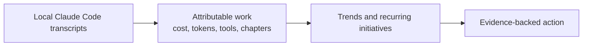
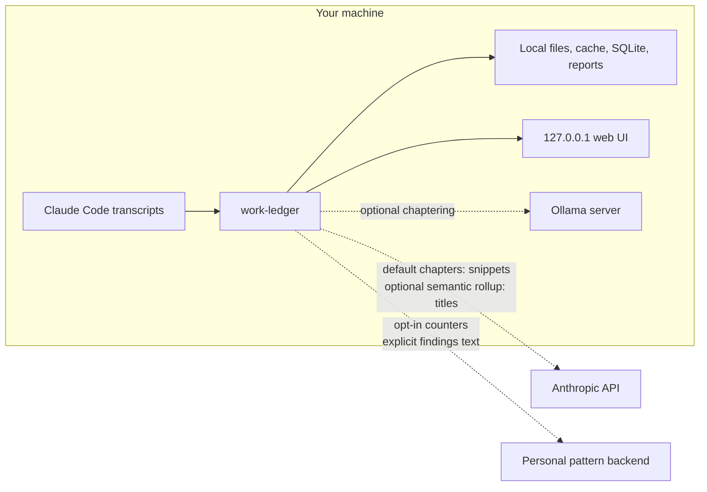

# work-ledger

[](https://github.com/dhk/work-ledger/actions/workflows/ci.yml)

work-ledger turns one person's local Claude Code transcripts into attributable usage, recurring-work trends, and evidence for improving how they work. It is a reader, not session instrumentation or a team observability platform.



Today, the strongest surfaces **show** what happened: live usage, costs, activity, chapters, timelines, trends, rollups, and repeated-work signals. Recommendations are an early **Tell** layer. **Do** automation is deliberately not presented as mature or automatic.

## Install

Published package:

```sh
python3 -m pip install --user work-ledger
```

Inside an active virtual environment, omit `--user`.

The commands below need **work-ledger 0.2.0 or newer**; `work-ledger about`
reports the version you actually have. If you end up on something older,
install from a source checkout instead — `uv` or `pipx` is the smoother
path, since `python3 -m venv` fails on a stock Ubuntu box without
`python3-venv` installed:

```sh
git clone https://github.com/dhk/work-ledger.git
cd work-ledger && uv venv && uv pip install -e .
```

Reviewed convenience installer:

```sh
curl -fsSL https://raw.githubusercontent.com/dhk/work-ledger/main/scripts/install.sh | bash
```

Read [`scripts/install.sh`](scripts/install.sh) before running it. For a careful isolated source install, extras, upgrades, and troubleshooting, see [INSTALL.md](INSTALL.md).

## Start here

```sh
work-ledger --once            # current session usage
work-ledger activity          # attribute work by kind/tool/skill
work-ledger chapters          # group work into initiatives (hosted by default)
work-ledger timeline          # practice over time
work-ledger trend             # cost over time
work-ledger --help
```

The complete CLI reference, including reports, rollups, recommendations, patterns, limits, and export, lives in [docs/commands.md](docs/commands.md). For running work-ledger's local web UI or connecting it to Claude itself via MCP, see [docs/commands.md](docs/commands.md#local-web-ui) and [INSTALL.md](INSTALL.md#using-work-ledger-inside-claude-mcp) respectively. The [documentation index](docs/README.md) separates shipped truth from research and proposals.

## Privacy and network boundary

Transcript parsing, cost calculation, activity, recommendations, deterministic rollups, exports, reports, and the read-only web UI run locally. `export` only writes a local file.

There are exactly five network paths in the adopted architecture:

1. `chapters` sends prompt and unit snippets to Anthropic's hosted Haiku API by default, using your credentials.
2. The optional Ollama chapter backend sends those snippets to a separately running server, localhost by default.
3. After `patterns enable` and backend configuration, anonymous recommended/used counters can go to your personal pattern backend.
4. With that same opt-in plus a findings token, explicit MCP findings submission sends review text to the personal backend.
5. `WORK_LEDGER_ROLLUP_MATCHING=semantic` opts rollup into sending unmatched initiative titles to hosted Haiku.



Failures in optional calls degrade to local results; they do not block the core views. The exhaustive, authoritative list and persisted-data model are in [docs/architecture.md](docs/architecture.md#network-calls-the-exhaustive-list).

## Scope and maturity

work-ledger is for an individual inspecting their own usage. It is not a team/org governance product, and the optional pattern backend remains personal-only and self-hosted. Cost estimates use a hardcoded pricing table and should be treated as estimates; Claude subscription limit thresholds are calibrated approximations.

See [PRODUCT_BRIEF.md](PRODUCT_BRIEF.md) for product boundaries, [ROADMAP.md](ROADMAP.md) for maturity, and [CONTRIBUTING.md](CONTRIBUTING.md) to make changes.

## License

MIT — see [LICENSE](LICENSE).
