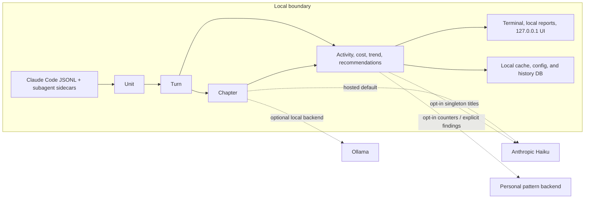

# Architecture

Status: adopted — describes the system as built, unlike the other
`docs/*.md` files which mostly propose unbuilt features. Update this file
when the *shape* of the system changes (a new core abstraction, a new
network boundary, a new persisted store) — not for every feature added
inside the existing shape.

This is the "how is it built" reference the roadmap's guardrail step
checks new work against — see `ROADMAP.md`'s "Using this as a guardrail".
For "what it is and why," see `PRODUCT_BRIEF.md`. For per-feature
proposals, see the other files in this directory.

## Data source and boundary

The practical consequence is that raw transcript parsing and every core view
stay on the user's machine. Only the labeled dashed paths cross a process or
machine boundary; the exhaustive conditions and payloads are listed below.

Everything work-ledger knows comes from Claude Code's own local session
transcripts (`~/.claude/projects/**/*.jsonl`), plus their subagent
sidecars (`<session>/subagents/agent-<id>.jsonl` + `.meta.json`). Nothing
is instrumented, no telemetry SDK is embedded in anything — the transcript
already exists for every session regardless of whether work-ledger is
installed. This is the load-bearing structural choice the rest of the
system follows from: work-ledger is a *reader*, never a participant, in
the Claude Code session itself.

One deliberate, narrow exception: `git_activity.py` (`serve`'s "Commits
during this session" panel) also reads the session's own git repo on
disk, correlated via the transcript's own `cwd` field — `git log`/`git
remote`, run locally, same subprocess precedent `about.py`'s own commit
detection already established. Still zero-network, still read-only, but
it's the one place work-ledger reads something beyond the transcript
itself. Degrades to simply not showing the panel (never an error) when
that repo isn't present locally, which is routine, not exceptional.

Known gap in this boundary, tracked separately: an older/different
install that inlines subagent activity as `isSidechain` entries in the
main transcript file (rather than the separate-file format above) isn't
parsed — see #46.

## Core data model

Three layers, each built strictly on top of the one below it — no layer
re-derives from raw JSONL itself except the bottom one:

1. **`Unit`** (`transcript.py`) — one assistant message, i.e. one real LLM
   API call (`message.id`). Transcripts write one JSONL line per content
   block (thinking/text/tool_use) but repeat the full `usage` block on
   every line for the same message — `Unit` is the dedup boundary that
   fixed the original 2-4x cost overcounting bug. Carries its own
   input/output tokens/cost plus, if it dispatched a subagent, that
   subagent's rolled-up usage too (`subagent_input_tokens` etc. populated
   asynchronously once the sidecar file is found). `Unit.kind` (`text` /
   `skill` / `subagent`) and `Unit.label` are what `activity.py` groups
   by — this is the one place "what kind of work was this" is decided.
2. **`Turn`** (`transcript.py`) — one full prompt exchange: a `prompt_id`
   plus every `Unit` (LLM call) that resulted from it. This is the
   default granularity the CLI dashboard shows; `--detail` drops down to
   the `Unit` level instead.
3. **`Chapter`** (`chapters.py`), made of `Section`s — a labeled group of
   `Turn`s representing one initiative ("Build the v1 dashboard"), plus a
   fixed-taxonomy `category`. This grouping can't be derived
   structurally (one initiative can span many prompts; one prompt can
   touch several), so it's the one layer that isn't purely local
   computation — see "Network calls" below.

Every other module (`activity.py`, `export.py`, `recommend.py`,
`report.py`) computes its view by summing/grouping this same
`Turn`/`Unit`/`Chapter` data — none of them re-parse the transcript or
introduce a competing cost calculation. `pricing.py` is the single seam
where token counts become dollars (`estimate_cost_usd`), keyed by model
id off a hardcoded rate table (`RATES`) — this is also the one place a
model-pricing change (see #47) needs to be reflected.

Being a hardcoded table makes a *missing* entry the failure mode to
design against, not a wrong number: an unpriced model renders `?` while
every other column stays fully populated, so the cost half of the tool
can go blank behind a UI that still looks healthy. That is exactly what
`claude-opus-5`'s absence did for weeks (#104). Two structural
consequences, both in `pricing.py`:

- **Unpriced models are named, not just counted.** Parsing records
  *which* model id had no rate (`Unit.own_unpriced_model` →
  `Turn.unpriced_models` → `TranscriptTailer.unpriced_models()`), and
  every surface's "some models unpriced" note names it. A note that says
  only *that* something is unpriced reads identically whether 0.1% or
  99% of turns are affected — which is why the gap survived so long.
- **A variant id never silently inherits the base rate.** A
  context-window variant (`claude-opus-5[1m]`) resolves only for models
  flagged `flat_long_context`, i.e. confirmed to serve their full context
  window at standard pricing. Anything else stays unpriced, because
  billing a long-context or fast-mode turn at the base rate would
  understate cost while looking exactly like a real figure.

## Caching and persistence

- **Chapter cache** (`chapters.py`, `_cache_path`) — one
  `<session-id>.chapters.json` file next to each transcript, holding
  already-labeled chapters/prompt-ids. Deliberately **frozen-prefix
  forever**: re-running only chapters newly-added turns, never re-pays
  for or retitles something already cached. Known, accepted tradeoff: an
  early mis-titled chapter can't self-correct later. This holds
  identically regardless of which `ChapterBackend` produced a chapter —
  #16 added a second backend (`OllamaBackend`, local-only) behind the
  same `get_chapters()`/cache code path, but deliberately did **not**
  touch this freeze behavior; unfreezing is a separate, still-open
  design question (see `docs/local-model-chaptering-design.md`'s "Open
  questions" and "Unfreezing chapters" — not decided, not implemented).
  See `docs/session-chaptering-design.md` for the original rationale.
- **Session pin** (`session_pin.py`) — a small local file remembering
  which session `chapters`/`activity`/`recommend` should default to,
  separate from the per-transcript cache above.
- **Limits threshold** (`limits.py`) — `~/.config/work-ledger/
  limits_threshold.json`, a user-calibrated token threshold, unrelated to
  any transcript.
- **Session history store** (`history.py`) — `~/.config/work-ledger/
  history.db`, a small sqlite database with one row per session (keyed by
  the same transcript UUID used everywhere else), holding turn count,
  cost, cached chapter count, the source transcript's mtime, and a
  last-synced timestamp. `sync_history()` is incremental: a session whose
  transcript mtime hasn't advanced past what's stored is skipped without
  being re-read (issue #42). This is additive infrastructure for future
  cross-session features (starting with #3) — `chapters --all`/
  `timeline`/`trend`/`serve` don't read from it and keep re-deriving their
  session list from a live `find_all_transcripts()` sweep, same as before.

## Network calls (the exhaustive list)

Everything above this line is 100% local. There are exactly five places
work-ledger talks to a network, all opt-in or explicitly disclosed, never
silent:

1. **`chapters`' hosted Haiku pass** (`AnthropicBackend`, the default
   `ChapterBackend`) — the only place real session content (prompt/unit
   snippets) leaves the machine to a third party at all. Requires the
   user's own `ANTHROPIC_API_KEY` (or `ant auth login`); on any failure
   (missing/invalid key, refusal, malformed response, exception) falls
   back to a single "Unsorted" chapter rather than crashing, with a
   specific, distinguishable error message per failure mode.
2. **`chapters`' local Ollama pass** (`OllamaBackend`, opt-in via
   `WORK_LEDGER_CHAPTER_BACKEND=ollama`) — talks to a local Ollama server
   (default `http://localhost:11434`, `OLLAMA_HOST` to override) instead
   of the hosted API. Session content still travels over localhost to a
   separate process, but never off the machine — this is the local-only
   counterpart to #1, added by #16.
   Requires the optional `ollama` PyPI package (`pip install
   "work-ledger[local-chapters]"`); missing package or unreachable server
   both fail with a specific, distinguishable message (same "never a raw
   stack trace, never silent" contract as #1) and fall back to
   "Unsorted" — never a silent fallback to the Anthropic backend. See
   `docs/local-model-chaptering-design.md`.
3. **Pattern-library counters** (`pattern_client.py`) — two anonymous
   counter increments (`report_recommended` / `report_used`) to a
   personally-run backend, only when `patterns enable` has been run and
   `WORK_LEDGER_PATTERN_BACKEND_URL` is set. Silent no-op, never an
   error, if either is missing.
4. **Findings submission** (`mcp_server.py`'s `submit_review_findings`) —
   forwards `ReportFindings`-shaped code-review output to the same
   backend. Needs both the URL above and a separate
   `WORK_LEDGER_FINDINGS_TOKEN` bearer credential, on top of the
   `patterns enable` gate — a stricter bar than the counters since this
   one carries free text. Same silent-no-op-if-unconfigured behavior.
5. **`rollup`'s semantic-matching pass** (`rollup_semantic.py`, opt-in via
   `WORK_LEDGER_ROLLUP_MATCHING=semantic`, default `deterministic` — #68)
   — a single batched Haiku call proposing merges among whatever
   `rollup.py`'s deterministic title-normalization pass left as singleton
   clusters, sent only when that env var is set. Same disclosure standard
   as #2's Ollama addition: never silent, and the deterministic pass (and
   everything downstream of it — `rollup`, `waste --cross-session`) keeps
   working exactly as before if this call fails for any reason (no
   credentials, a rejected key, a refusal, a malformed response, any
   other exception) — it degrades to the deterministic-only result with a
   distinguishable printed note, never blocking `rollup`/`waste
   --cross-session`'s core functionality on its availability. No caching
   or versioning of merge decisions — see
   `docs/rollup-semantic-matching-design.md`'s Non-goals.

`export` is explicitly **not** on this list — it writes a local file and
stops; there is no sixth network call hiding behind it.

## Module map

| Module | Owns |
|---|---|
| `transcript.py` | Locating/tailing transcripts; `Unit`/`Turn`; the message.id dedup fix; subagent sidecar correlation |
| `chapters.py` | `Section`/`Chapter`; the labeling pass behind a pluggable `ChapterBackend` (`AnthropicBackend` default, `OllamaBackend` opt-in - #16); frozen-prefix cache, backend-agnostic |
| `activity.py` | Grouping cost by `Unit.kind`/`skill_name`/`subagent_agent_type`/`tool_names` — no API call |
| `pricing.py` | The `RATES` table and `estimate_cost_usd` — the only tokens→dollars conversion in the codebase |
| `export.py` | Building the local anonymized export JSON — never sends it anywhere |
| `recommend.py` | Local, rule-based heuristics over `Turn`/`Unit`/`Chapter` |
| `patterns.py` | Loading the shared pattern library's local `*.md` entries |
| `pattern_client.py` | Opt-in gate, per-install anonymous id, counter reporting to the backend |
| `limits.py` | Rolling Pro/Max session-window usage; self-calibrated threshold |
| `history.py` | Local sqlite session-history store (`~/.config/work-ledger/history.db`); incremental, mtime-gated sync - additive, not yet read by anything else (#42) |
| `timeline.py` | Day-bucketing `activity.py`'s categorization plus cached chapter categories - how practice changed over time, not what it cost |
| `trend.py` | Day/week-bucketing `Turn.cost_usd` - is spend trending up or down, the cost axis `timeline.py` deliberately excludes |
| `rollup.py` | Clustering chapters into recurring initiatives across sessions by deterministic title normalization, plus an optional semantic second pass (#68, via `rollup_semantic.py`), and summing cost per cluster (#3) - reads only already-cached chapters, never triggers a chaptering pass; `build_rollup_result`'s `key_map` is the one shared clustering entrypoint `waste.py` also uses |
| `rollup_semantic.py` | Optional, opt-in (`WORK_LEDGER_ROLLUP_MATCHING=semantic`) batched Haiku pass proposing merges among `rollup.py`'s still-singleton clusters (#68) - never cached/versioned, always degrades to the deterministic-only result on any failure |
| `waste.py` | Flagging repeated-read/repeated-subagent patterns and their cost, within one session/chapter and (via `rollup.py`'s `build_rollup_result`/`key_map`, shared with `rollup` itself - #68) across every session of the same initiative (#5) - Show-stage, not prescriptive (that's #6) |
| `report.py` | Self-contained HTML/PNG rendering shared by `chapters --report` / `activity --report` |
| `session_pin.py` | The "pin a session" mechanism |
| `cycle.py` | Detects editable-clone vs. pipx/uv-tool/pip install and runs the matching upgrade step (`work-ledger cycle`, issue #73) - never auto-restarts a long-lived command, only warns if one looks like it's running |
| `about.py` | The "About" block (issue #75): description, version, last-updated, commit (if resolvable from an editable git checkout, via `cycle.detect_install_mode()`), and author/repo attribution - one shared computation reused by `work-ledger about`, `work-ledger-mcp`'s `about` tool, `serve`'s pages, and every generated report's footer, rather than four separate implementations |
| `mcp_server.py` | The local MCP server exposing pattern-library tools over stdio, plus the unconditional `about` tool (issue #75) |
| `cli.py` | Argument parsing and the live terminal dashboard; wires every module above into subcommands |

## Structural constraints (don't violate without updating this doc)

- A new feature that reads transcript data goes through `transcript.py`'s
  existing `Unit`/`Turn` — it does not re-parse JSONL itself.
- A new feature that needs grouping/labeling beyond what `Unit.kind` or
  `Chapter.category` already provide extends those, rather than inventing
  a parallel categorization scheme (this is why the timeline view, #44,
  is scoped as "reuse `activity.py`'s taxonomy with a time axis added,"
  not a new one).
- Any new network call is opt-in, disclosed in this file's "Network
  calls" section, and never blocks core (local-only) functionality on its
  availability.
- Any new persisted store lives beside the transcript it derives from (or
  in `~/.config/work-ledger/`, matching `limits.py`'s precedent) — not in
  a location that implies it's synced or shared anywhere.
